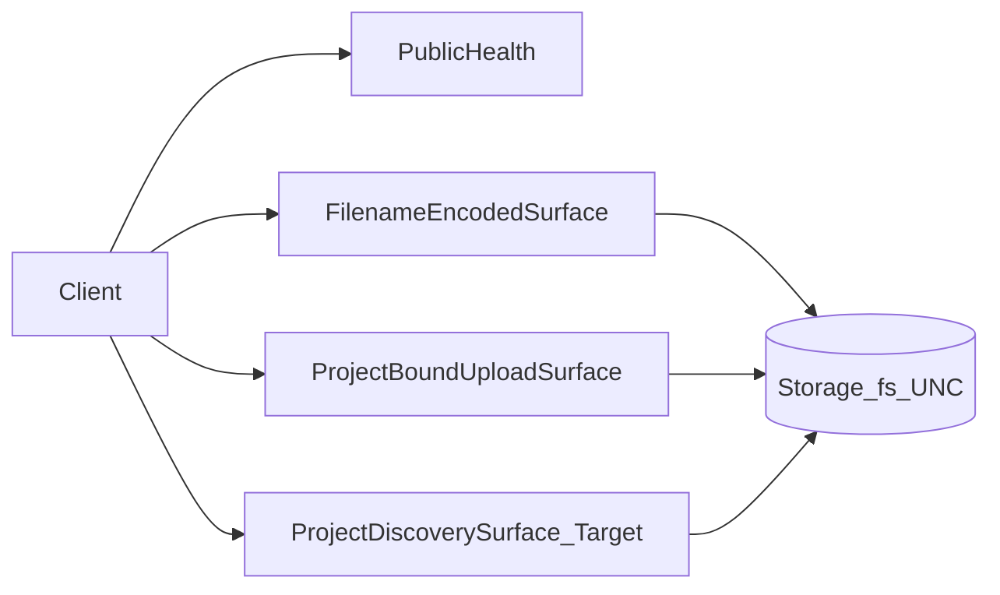

# Architecture — AES File Service Client

## Stack

- **Runtime:** Node.js ≥16
- **App:** Express + Multer
- **Authn:** shared API key (`X-API-Key`)
- **Storage:** `fs` under configured root / project paths
- **Spec Kit:** [`.specify/`](../../.specify/)

## Dual surfaces

## Agent contract

Follow [`.specify/spec.md`](../../.specify/spec.md). Domain changes require ontology updates and `validate_spec.py`.

## Note on layout

HEAD uses flat root modules plus partial `src/services/`. README nested `src/` tree is **Target**, not Implemented.
